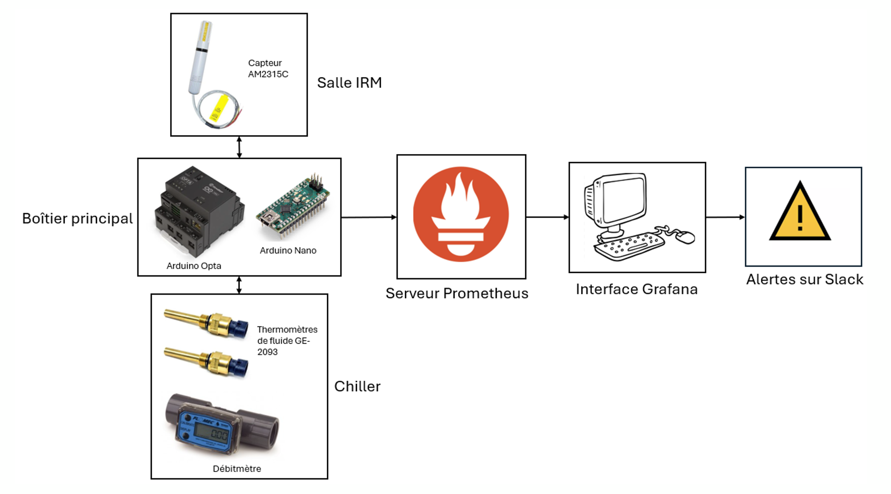

Monitoring Solution for MRI System
Mid-Project Presentation – December 5th, 2024

By 
Louis-Antoine Delisle, Charlotte Pépin, William Sirois, Emmy Tran-Khanh et Héloïse Warin

As part of the course GBM8970 – Integretor Project in Biomedical Engineering

1. CONTEXT AND DEFINITION OF MANDATE
1.1. Project Goals 
Develop a Monitoring Solution for MRI System

1) Monitor the temperature and humidity of the MRI room
2) Measure in real-time the flow rate and temperature of the water entering and exiting the chiller
3) Develop a centralized monitoring interface using a microcontroller Arduino Opta
4) Create a dashboard on Grafana to visualize real-time data
5) Detect abnormal values and send alerts on Slack

1.2. Functional Specifications
Beyond the Range Values, Alerts Must be Sent on Slack 

MRI Room Temperature:
Accepted Range = [18, 22]°C
Acquisition Frequency = 1 min
Precision = ±0,1°C
Accuracy = ±1°C

Water Temperature:
Accepted Range = [6, 12]°C
Acquisition Frequency = 5 sec
Precision = ±0,1°C
Accuracy = ±1°C

Water Flow Rate
Accepted Range = Min.: 90L/min
Acquisition Frequency = 5 sec

1.3. Solution Structure
Mid-project stage: Diagram is Functional and Only Slack Alerts and Flow Meter are Missing 

2.    PROTOTYPE AND PRELIMINARY RESULTS
2.1.Measurement of the Temperature and Humidity of the MRI Room
Arduino Nano allows I2C Bus Communication

2.2. Measurement of Water Temperature at Inlet and Outlet of the Chiller 
Arduino Opta collects all measurements and transmits them to the Prometheus server via a Pushgateway

2.3. Interface on Grafana
Modular, it Displays Results and History, updating them every 15 seconds

3.    CHALLENGES
Current Challenges and Areas for Improvement for Next Iteration
The PCB Should Improve Precision, Accuracy and Stability
3.1. Current Data Accuracy: ± 1°C
3.2. Connections and System Stability
3.3. Reading Data from Flow Meter

4.    NEXT STEPS
Months to Implement the Solution at UNF and Perform Tests
Final Presentation: Week of April 14th, 2025
4.1 Add the shield for the flow meter
4.2 Create and order the PCB
4.3 Adjust the precision, interface, and history 
4.4 Program the alarms
4.5 Print or order the enclosure (box)
4.6 Perform tests and implement the solution at UNF 

5.    DISCUSSION AND QUESTIONS
5.1. How do you find the interface? What other information would would you like to see on?
5.2. Where would you like to store the data, and for how long?
5.3. Which parts had you pre-budgeted for the project?

APPENDICES
1. Budget Status After the First 3 Months
Arduino Opta
260.20 $
Water Thermometer
31.16 $
Air Thermometer
35.65 $
24V Power Supply
10.34 $
Voltage Regulator
11.90 $
Protoboard
11.14 $
Heat Sinks
1.56 $
Operational Amplifier
28.06 $
Arduino Nano
11.16 $
Second Air Thermometer
42.19 $
Total
443.36 $
